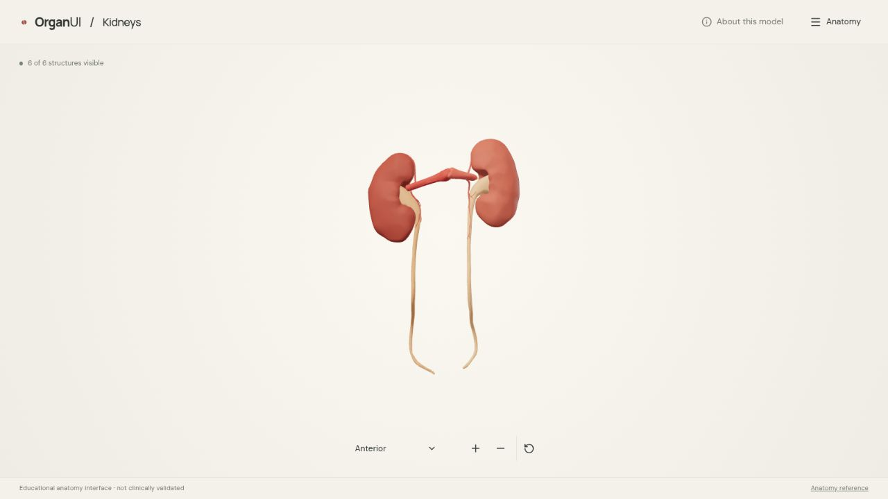
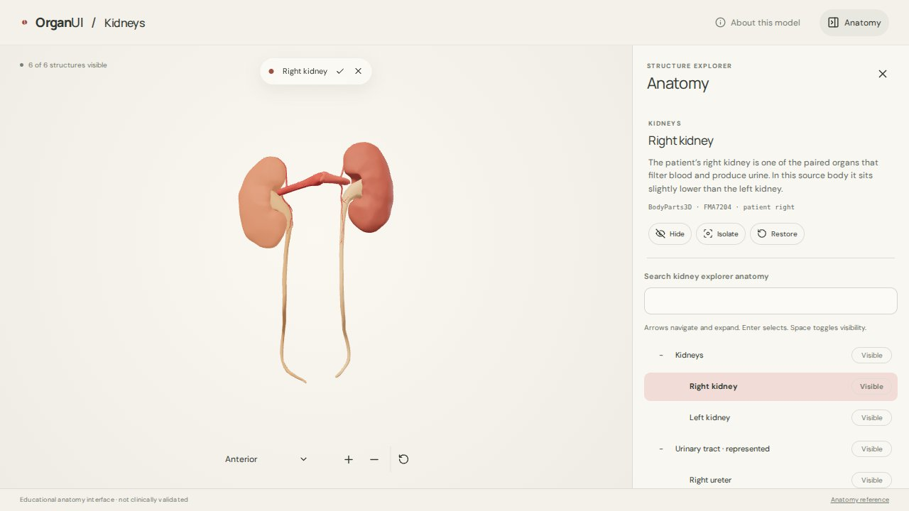

# OrganUI Kidneys

A standalone 3D explorer of verified kidney, ureter, and renal-artery geometry. It is also a complete consumer example for the published [OrganUI anatomy-tree registry component](https://organui.com/docs/anatomy-tree).



## What is represented

The runtime model contains six selectable structures from BodyParts3D 4.0: the patient’s right and left kidneys, right and left ureters, and source-mapped right and left renal arteries. It preserves their shared source alignment and patient laterality. It does **not** add cortex, medulla, nephrons, renal pelvis geometry, cut surfaces, the bladder, physiology, or disease overlays.

The app provides:

- rotate, keyboard rotate, zoom, reset, four named views, and a Custom view state;
- synchronized scene/tree selection and a concise sourced structure description;
- controlled leaf visibility with derived mixed parent states;
- hide, show, isolate, restore, search, and full reset behavior;
- a four-stop tour of the anatomy actually represented;
- mobile layout, reduced-motion handling, loading feedback, missing-model recovery, and a WebGL fallback;
- an anatomy-text experience that remains usable without the 3D canvas.



## Run locally

Requirements: [Bun 1.4.2](https://bun.sh/) and a current browser with WebGL. Older Bun releases (for example 1.3.x) cannot read the lockfile format and fail `--frozen-lockfile`.

```sh
bun install --frozen-lockfile
bun run verify:model
bun run dev
```

The development server prints its local URL. To run the complete non-browser verification:

```sh
bun run typecheck
bun run test
bun run build
```

The text `bun.lock`, installed registry source, and runtime GLB are committed. An ordinary clean checkout does not require the OrganUI registry, neighboring repositories, or BodyParts3D downloads.

## Rebuild the model

The tracked runtime model can be reproduced from checksum-pinned official inputs:

```sh
bun run prepare:model
bun run verify:model
```

`prepare:model` downloads raw inputs only when `.asset-cache/` does not already contain them. Raw archives and intermediates stay ignored. See [model provenance](docs/MODEL_PROVENANCE.md) for mappings, transformations, license terms, and scope decisions.

## Integration and verification

- [Registry integration guide](docs/REGISTRY_INTEGRATION.md)
- [Model provenance](docs/MODEL_PROVENANCE.md)
- [Verification report](docs/VERIFICATION.md)
- [Build brief](docs/BUILD_BRIEF.md)

## License and review status

Application code is MIT licensed. The model is separately licensed under CC BY 4.0 and requires this credit:

> BodyParts3D, © The Database Center for Life Science licensed under CC Attribution 4.0 International.

This is an educational interface demonstration, not a diagnostic or clinical tool. Developer source/mapping review and runtime verification are complete. Independent review by a clinical anatomy expert, physical-device testing, and manual screen-reader testing have not been completed.
